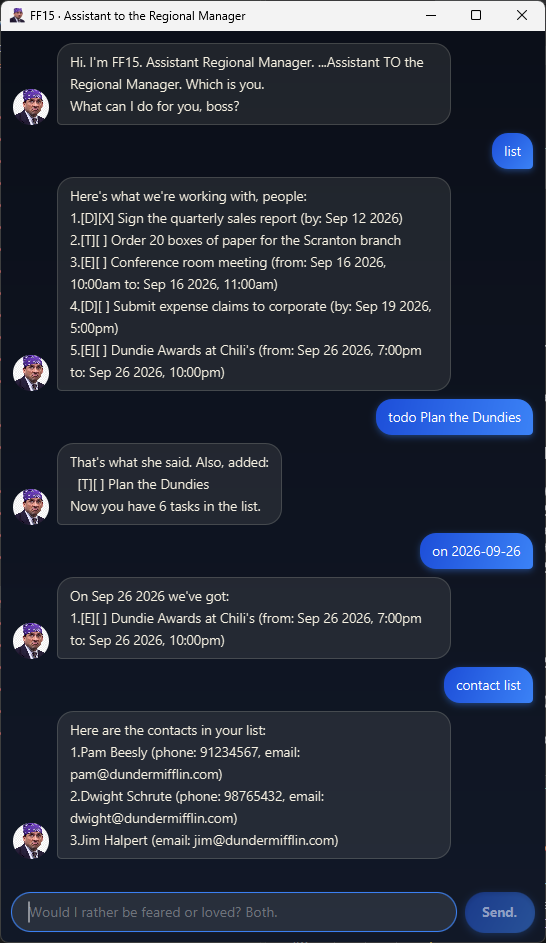

# FF15 User Guide



**FF15** is a desktop app for keeping track of your tasks and your contacts, typed one line at a time. It talks like a regional manager who thinks he is your assistant. He is not. You are the boss.

- [Quick start](#quick-start)
- [Features](#features)
  - [Adding a todo: `todo`](#adding-a-todo-todo)
  - [Adding a deadline: `deadline`](#adding-a-deadline-deadline)
  - [Adding an event: `event`](#adding-an-event-event)
  - [Listing all tasks: `list`](#listing-all-tasks-list)
  - [Marking a task done: `mark` / `unmark`](#marking-a-task-done-mark--unmark)
  - [Deleting a task: `delete`](#deleting-a-task-delete)
  - [Finding tasks by keyword: `find`](#finding-tasks-by-keyword-find)
  - [Seeing what is on a date: `on`](#seeing-what-is-on-a-date-on)
  - [Managing contacts: `contact`](#managing-contacts-contact)
  - [Exiting: `bye`](#exiting-bye)
  - [Saving your data](#saving-your-data)
- [FAQ](#faq)
- [Command summary](#command-summary)

## Quick start

1. Make sure you have Java 25 or above installed.
2. Download the latest `ff15.jar` from the [releases page](https://github.com/My2h/ip/releases).
3. Put it in the folder you want FF15 to keep its data in.
4. Open a terminal in that folder and run `java -jar ff15.jar`. The window above appears, and FF15 introduces itself.
5. Type a command in the box at the bottom and press <kbd>Enter</kbd> (or click **Send.**). Some to try:
   - `todo read book` — adds a task
   - `list` — shows every task
   - `mark 1` — ticks off the first one
   - `bye` — closes FF15
6. The box shows a hint when it is empty. Half of them are commands you can type; the other half are Michael. <kbd>Esc</kbd> clears whatever you have typed.

## Features

> **How to read the formats**
> - Words in `UPPER_CASE` are what you supply: `todo DESCRIPTION` means `todo read book`.
> - Parts in `[square brackets]` are optional.
> - `DATE` is `yyyy-mm-dd`, e.g. `2026-09-20`. Add a 24-hour time after it if you want one: `2026-09-20 1800`.
> - Task numbers are the ones `list` shows, counting from 1.
> - Commands are lowercase. `List` is not `list`.
> - Extra spaces are fine; `todo   read   book` is the same as `todo read book`.
> - A `|` is not allowed in descriptions or names; FF15 uses it in its save file.

### Adding a todo: `todo`

A task with no date attached.

Format: `todo DESCRIPTION`

Example: `todo read book`

```
That's what she said. Also, added:
  [T][ ] read book
Now you have 1 tasks in the list.
```

### Adding a deadline: `deadline`

A task that is due by a date, and optionally a time.

Format: `deadline DESCRIPTION /by DATE`

Examples:
- `deadline return book /by 2026-09-20`
- `deadline submit report /by 2026-09-20 1800`

```
Got it. Added:
  [D][ ] submit report (by: Sep 20 2026, 6:00pm)
Now you have 2 tasks in the list.
```

### Adding an event: `event`

A task that runs from one date to another. Each end may carry a time. It has to end after it starts.

Format: `event DESCRIPTION /from DATE /to DATE`

Examples:
- `event conference /from 2026-10-05 /to 2026-10-07`
- `event project meeting /from 2026-09-25 1400 /to 2026-09-25 1600`

```
Am I invited? ...I'm invited. Added:
  [E][ ] project meeting (from: Sep 25 2026, 2:00pm to: Sep 25 2026, 4:00pm)
Now you have 3 tasks in the list.
```

FF15 refuses a task that is identical to one already in the list, and tells you which one it duplicates.

### Listing all tasks: `list`

Shows every task, numbered. `[T]`, `[D]` and `[E]` mark todos, deadlines and events; `[X]` marks a task that is done.

Format: `list`

```
Here's what we're working with, people:
1.[T][ ] read book
2.[D][ ] submit report (by: Sep 20 2026, 6:00pm)
3.[E][ ] project meeting (from: Sep 25 2026, 2:00pm to: Sep 25 2026, 4:00pm)
```

### Marking a task done: `mark` / `unmark`

Format: `mark TASK_NUMBER` or `unmark TASK_NUMBER`

Example: `mark 1`

```
Boom. Done. That's a Dundie right there:
  [T][X] read book
```

`unmark 1` puts it back the way it was.

### Deleting a task: `delete`

Format: `delete TASK_NUMBER`

Example: `delete 2`

```
Gone. Like Toby, if I had my way. Removed:
  [D][ ] submit report (by: Sep 20 2026, 6:00pm)
Now you have 2 tasks in the list.
```

The tasks after it move up a number, so check `list` before deleting again.

### Finding tasks by keyword: `find`

Shows every task whose description contains the keyword. Capitalisation does not matter.

Format: `find KEYWORD`

Example: `find book`

```
Found them. I'm basically a detective. Michael Scarn:
1.[T][X] read book
```

### Seeing what is on a date: `on`

Shows the deadlines due, and the events running, on a day. Give a month or a year to widen the search. Todos have no date, so they never appear here.

Format: `on DATE`, `on yyyy-mm` or `on yyyy`

Examples:
- `on 2026-09-25` — that day
- `on 2026-09` — the whole month
- `on 2026` — the whole year

```
On Sep 25 2026 we've got:
1.[E][ ] project meeting (from: Sep 25 2026, 2:00pm to: Sep 25 2026, 4:00pm)
```

### Managing contacts: `contact`

Contacts live in their own list, separate from tasks. A contact has a name, and may have a phone number and an email.

| Format | What it does |
|---|---|
| `contact add NAME [/phone PHONE] [/email EMAIL]` | Adds a contact. `/phone` and `/email` are optional and can come in either order. |
| `contact list` | Shows every contact, numbered. |
| `contact find KEYWORD` | Shows the contacts whose name contains the keyword. |
| `contact delete CONTACT_NUMBER` | Removes a contact, by its number in `contact list`. |

Examples:
- `contact add Pam Beesly /phone 91234567 /email pam@dundermifflin.com`
- `contact add Jim Halpert /email jim@dundermifflin.com`
- `contact add Dwight Schrute`

```
New friend. I'm friends with everyone. Added:
  Pam Beesly (phone: 91234567, email: pam@dundermifflin.com)
1 contacts. I know everyone. Everyone knows me.
```

`contact list` then shows:

```
Here are the contacts in your list:
1.Pam Beesly (phone: 91234567, email: pam@dundermifflin.com)
2.Jim Halpert (email: jim@dundermifflin.com)
3.Dwight Schrute
```

A phone number may contain digits, spaces, `+`, `-` and brackets. An email needs an `@` with something on both sides.

### Exiting: `bye`

Format: `bye`

FF15 says goodbye and the window closes a moment later.

```
See ya tomorrow, boss.
```

### Saving your data

Everything is saved automatically after every change. There is no save command.

- Tasks go in `data/ff15.txt` and contacts in `data/contacts.txt`, in a `data` folder next to where you ran FF15. Both are created the first time they are needed.
- Both files are plain text, so you can edit them. If FF15 cannot read a line, it tells you which line it skipped and carries on with the rest, so a typo never costs you the whole file.

## FAQ

**Q: FF15 says "No. GOD. NO." What did I do?**
A: Nothing dangerous. That is how it starts every error. The rest of the message says what was wrong with the command and usually shows an example of it done right.

**Q: How do I move my tasks to another computer?**
A: Copy the `data` folder next to `ff15.jar` on the new computer, and run FF15 from there.

**Q: Can I use `31/12/2026` as a date?**
A: No. Dates are `yyyy-mm-dd`, so `2026-12-31`. Times are 24-hour with no colon: `1800`, not `6pm`.

**Q: Why does `find` not find my contacts?**
A: `find` searches tasks. Use `contact find` for contacts.

## Command summary

| Action | Format | Example |
|---|---|---|
| Add todo | `todo DESCRIPTION` | `todo read book` |
| Add deadline | `deadline DESCRIPTION /by DATE` | `deadline return book /by 2026-09-20 1800` |
| Add event | `event DESCRIPTION /from DATE /to DATE` | `event meeting /from 2026-09-25 1400 /to 2026-09-25 1600` |
| List tasks | `list` | `list` |
| Mark done | `mark TASK_NUMBER` | `mark 1` |
| Mark not done | `unmark TASK_NUMBER` | `unmark 1` |
| Delete task | `delete TASK_NUMBER` | `delete 2` |
| Find tasks | `find KEYWORD` | `find book` |
| Tasks on a date | `on DATE` / `on yyyy-mm` / `on yyyy` | `on 2026-09` |
| Add contact | `contact add NAME [/phone PHONE] [/email EMAIL]` | `contact add Pam /phone 91234567` |
| List contacts | `contact list` | `contact list` |
| Find contacts | `contact find KEYWORD` | `contact find pam` |
| Delete contact | `contact delete CONTACT_NUMBER` | `contact delete 1` |
| Exit | `bye` | `bye` |
